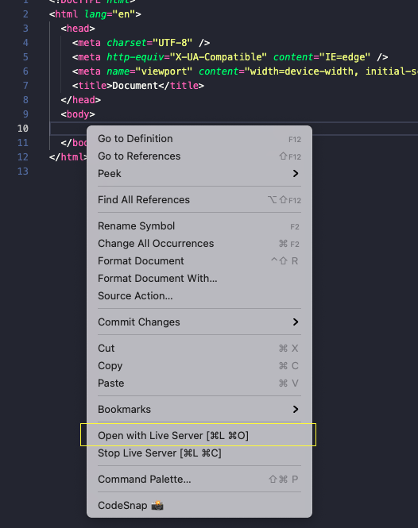
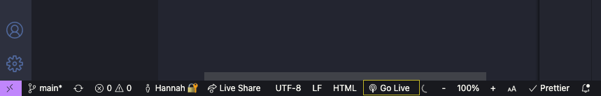

# Intro to Computer Science - Basic HTML

To trace your progress you can mark completed tasks by inserting an X within the square brackets [ ] in the `README.md` file in VSCode.

## Prepare

Unsure about gitHub?
→ Review [Version Control with Git and GitHub](https://redi-school.github.io/ber-dcp-intro-to-computer-science/docs/git/git_and_github_desktop/) lesson.

Create a new branch, which will contain your new version of the project with the new feature. In GitHub Desktop, do this by clicking on Current Branch > New Branch or Branch > New Branch. Give your branch (version) a useful and descriptive name, ideally about the changes/feature you want to make in this version.

<details>
  <summary>"How are you planning to use this fork?"</summary>
    
  Select "For my own purposes"
  
    → for most of our class activities we will select "For my own purposes" - for contributing to open source projects or projects owned by others, select "To contribute to the parent project"
</details>

<br>

#### See your changes

- you can open the folder in your finder/explorer and double click on index.html (disadvantage: every time you make changes you have to reload the page)
- `Live Server` is a great tool to see your changes in real time (you should have installed it at the beginning)
- Every time you save your website will automatically get the newest changes
- To start the Live Server either right click in the root index.html file and select **Start Live Server** (Option 1) or click on **Go Live** (Option 2) in the bar at the bottom - when it is running it will say `Port: 5500` there - always leave it running to see the changes.

<details>
  <summary>Option 1</summary>
    
  
</details>
<details>
  <summary>Option 2</summary>
    
  
</details>

<hr>

## Let's code 🚀

### Add HTML to display general journal information and clickable list of years

- [ ] Open `index.html` in the top level
- [ ] Add HTML markup to:
  - [ ] Add the basic html skeleton
  - [ ] Display a page title for your journal
  - [ ] Display a header for your journal
  - [ ] Add an image to your header
  - [ ] Display a list of clickable years (2021, 2022)

Optional:
If you want to add a very simple CSS style to your website, just add this line in the `<head>` section:

```html
<link rel="stylesheet" href="style.css" />
<!-- If you want to add it to a file that is in a nested folder, you first need to get up to that level with using `../` -->
<link rel="stylesheet" href="../style.css" />
```

### Add HTML to display general information for a year's journal entries and clickable list of months

- [ ] Open the 2022 Journal page `2022/index.html`
- [ ] Add HTML markup to:
  - [ ] Display a page title indicating the year
  - [ ] Display a header indicating the year
  - [ ] Display a list of clickable months in the year (January-December)
  - [ ] Add a button to go back the homepage
- [ ] Repeat the previous steps for 2021 in the `2021/index.html` file

### Add HTML to display general information for a month's journal entries and clickable list of days

- [ ] As an example, create the April 2022 Journal page - `2022/april/index.html`
- [ ] Add HTML markup to:
  - [ ] Display a page title indicating the month and year
  - [ ] Display a header indicating the month and year
  - [ ] Add a button to go up one level `2022/index.html`
- [ ] Repeat the previous steps for all other months across your journal

### Add a single daily journal page in April 2022

- [ ] Go to the `2022/april` folder
- [ ] Create a new file 21.html
- [ ] Add HTML markup to:
  - [ ] Display a page title indicating 21st April 2022
  - [ ] Display a header indicating the day, month and year of todays date (21st April 2022)
  - [ ] Display an image or youtube video you like
  - [ ] Display any journal text you like
- [ ] Go to the `2022/april/index.html` page
- [ ] Add HTML markup to:
  - [ ] Display a link to the journal page for 21st april 2022 (`2022/april/21.html`)


### Push (upload) your work to github

- When satisfied with code you can merge your branch into `main`.
- Do not forget to push your work to GitHub!

## Extra:

### Publish to github pages

- so far our website is only a local file
- to share a link that others can visit we need to host our pages somewhere, luckily gitHub has a option called `GitHub Pages` to host our repository files on the internet

  [Read about getting started with GitHub Pages](https://docs.github.com/en/pages/getting-started-with-github-pages/creating-a-github-pages-site)
